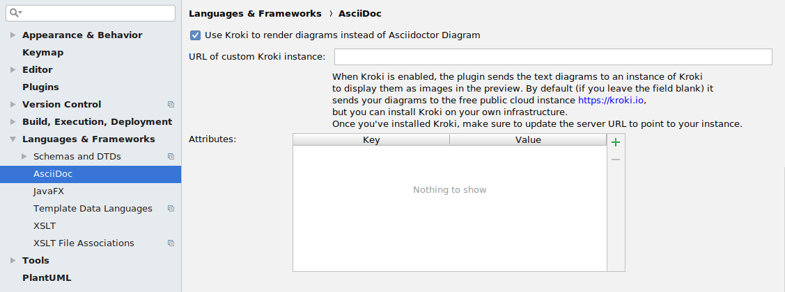

= Features of the AsciiDoc IntelliJ plugin

:experimental:
:icons: font

:uri-kroki: https://kroki.io
:uri-asciidoctor-diagrams-gh: https://github.com/asciidoctor/asciidoctor-diagram
:uri-asciidoctor-diagrams-execs: {uri-asciidoctor-diagrams-gh}#specifying-diagram-generator-paths

////
= Contribution Guideline for this document:

This guideline should lead to a style that is comprehensible to the user.

Don't assume people are developers and have worked with IntelliJ before -- this should be for writers or business analysts as well, and also for first-time IntelliJ users.

Naming the actor, the active voice and the present tense makes it easier for non-native speakers to understand this document.
Adding the shortcuts should help users new to IntelliJ.

Each sentence should on its own line.

== Check lists for writing content

Name the actor::
Examples: user, preview, editor, plugin

Provide Keyboard shortcuts::
Example: kbd:[Alt+7]

Use active voice::
Good: "The preview displays the result" +
Bad: "The result is displayed"

Use present tense::
Good: "The preview displays the result" +
Bad: "The preview will display the result"

Use only on capital letter for Keyboard shortcuts::
Good: kbd:[Alt+7] +
Bad: kbd:[ALT+7]
////

== About

This document details the features available in the plugin to users of the plugin.
Use it as a reference guide to find out what the plugin can do today.
The plugin should work "`like any other IntelliJ plugin`" when it comes to shortcuts and configurations.
If not, please describe the expected behaviour in a https://github.com/asciidoctor/asciidoctor-intellij-plugin/issues[GitHub issue].

Please consider to contribute to this document: open a bug when something is unclear, missing or wrong.
You can even create a pull request for this document!

NOTE: Parts that are marked to be experimental are likely to have corner cases that are not yet implemented, may have bugs.
They can change their behaviour between releases at any time.

== Features

=== Basic

* Recognizes the AsciiDoc file extension (.adoc, .asciidoc, .ad)
* Provides a split view with
** editor with syntax highlighting (per default on the left) and
** live preview (per default on the right)
* Toolbar and context menu for basic formatting and to create tables
* Refactor Markdown to AsciiDoc:
Right click on a file, or use the Refactor menu, and plugin replaces the Markdown document by the AsciiDoc equivalent.
Also supports undo, in case the user is not happy with the result!

=== Editor

==== Navigation

// see: AsciiDocFoldingBuilder
The user can fold sections and blocks using the small +/- symbols on the left of the editor.
Folded sections and blocks show their first line except when this is block id (like `\[[id]]`).

// see: AsciiDocStructureViewElement
The structure of the file kbd:[Alt+7] shows the hierarchy of sections and blocks with titles.
This contains (if available) the first block attribute element (like \[source], \[quote] or \[verse]) and the title of the block or section.
If an element like an `image::[]` references another file, it shows the icon of the file and the file's name.
If an `include::[]` references an AsciiDoc file, it includes the file as a sub-tree in the structure view.
Clicking on either a referenced file or an element of a sub-tree opens the referenced file.

// see: AsciiDocChooseByNameContributor and AsciiDocSearchEverywhereClassifier
The search all view kbd:[Shift]kbd:[Shift] shows section titles and IDs of blocks.

The breadcrumbs view (bottom of the editor) shows the hierarchy leading to the current sections and blocks.
It contains the same elements like in the structure view for the cursor position.

For `include::[]` and `image::[]` block macros the keys kbd:[Ctrl+Click] and kbd:[Ctrl+B] navigate to the referenced file.

For references (like `\<<id>>`) the keys kbd:[Ctrl+Click] and kbd:[Ctrl+B] navigate to the reference (like `\[[id]]`).
This works similarly for attributes (`\{attrib}` and `:attrib:`).
"`Find Usages`" (kbd:[Alt+F7]) finds usages of references and attributes and allows navigation.

// see: AsciiDocDocumentationProvider
The user can show quick documentation for the element at the cursor's position using kbd:[Ctrl+Q].
At the moments this works for attributes (`\{attrib}` and `:attrib:`) both in the editor and when using autocomplete.

The plugin highlights matching braces including symmetric formatting for bold, italic and monospace.

IntelliJ's built-in spell checker verifies all text areas of the document.
It underlines unknown words with a green wavy line.
With the context menu the user can change the spelling or to add the word to the project's dictionary.
To enable spell-checking support for other languages, the user can add a dictionary file via "`Editor | Spelling`".
Dictionaries are available online for example at http://www.winedt.org/dict.html.
Word lists need to be in the UTF-8 format to work.

// see: ExternalAnnotator
During rendering Asciidoctor might indicate problems in the file including a line number.
The editor shows them as red and yellow annotations.
Hover over the annotations to see the full warning or error message.
The user can disable this feature in the settings.
If it is disabled in the settings, errors show up in the event log.

When the text contains Markdown style headings (starting with `#`) or old style Asciidoc headings (titles underlined with string or characters matching the length or the heading), the editor highlights this in yellow and offers a quick fix to convert these to a new style Asciidoc heading.

The editor supports a default and dark theme.
The user can change the colors of the theme in the IDE settings.

When using listings with `[source,lang]`, the plugin triggers language injection to the following code block when the language is supported by the IDE (either by default, or by a language plugin).
This allows syntax highlighting and code completion specific to the language of the code block.
The user can disable this feature in the settings completely or for selected languages.
For the user to re-format the code block, use "`Edit Fragment`" (kbd:[Alt+Enter]) and "`Reformat Code`" ( kbd:[Ctrl+Shift+L]).

All comments containing a `TODO` and `FIXME` and are indexed in the Todo-View (kbd:[Alt+6]).
The user can configure the keywords in the IDE settings.

// see: BrowserPanel for creating the HTML
// see: PreviewStaticServer for delivering the contents to the Browser
In the editor the user can select from a list of browsers that are showing in the upper right corner of the editor to preview the document.
The user can also trigger this action from the context menu.
To update the preview in the browser the user needs to refresh the contents by pressing kbd:[F5] in the browser.

The user can open an AsciiDoc file in an external tool (like for example Google Chrome with the https://github.com/asciidoctor/asciidoctor-browser-extension[Asciidoctor Extension] installed).
To do this, add Chrome as an https://www.jetbrains.com/help/idea/settings-tools-external-tools.html[external Tool in the settings].
Provide `$FilePath$` as the argument so that Chrome knows where to find the file.
The user can assign a shortcut to the external tool using "`Help | Find action... | (type the name of external tool) | kbd:[Alt+Enter] | (type the shortcut of choice) | OK`".

==== Writing

// see: AsciiDocSmartEnterProcessor
When adding block attributes, the plugin supports statement completion (also known as "`Smart Enter`") using the shortcut kbd:[Shift+Ctrl+Enter].
For example: a `[source,java` receives a closing bracket and two listing separator lines.

// see: AsciiDocBraceMatcher
When the user opens a quote or a bracket, the plugin automatically adds a closing quote if it followed by whitespace or a closing bracket.

For references, attributes and images, and several macros like include, image and diagrams it provides auto-completion using kbd:[Ctrl+Space].
References and attributes support renaming within a project.

When auto-completing folder and file names in macros, the plugin tries to resolves attributes using their values specified in the current file or other files.
For image macros it tries to find a declaration of the _imagesDir_ attribute either in any of the Asciidoc files of the project.

There are several live templates included.
Once the user starts typing kbd:[a]kbd:[d], a list of templates appears.
Continued typing of any character of the template name restricts the list.
A kbd:[Tab] selects and entry.

The user can copy images from the clipboard into the document.
To do that user selects "`Paste image from clipboard`" from the editor's icon menu or from the context menu.
If the clipboard contains a reference to an existing file, the user can choose to copy the file to the project or to just create a reference to the image in the AsciiDoc document.
If the clipboard contains an image, the user can choose to create a JPEG or PNG file from the clipboard and add the reference to the document.

As a shortcut the user can also use kbd:[Ctrl+C] and kbd:[Ctrl+V] to add references to images from within the project to a document.
This shortcut doesn't work yet for copying contents from outside the project.

// AsciiDocHeadingStyleInspection, ...
The editor runs inspections on the content.
Once it finds for example Markdown-styled headings or Markdown-styled horizontal rules it highlights this as a warning.
The user can use kbd:[Ctrl+Enter] to select a quick-fix to convert these to AsciiDoc syntax.

The user can extract and inline includes.
This is available from the "`Refactor`" context menu and via context-sensitive intentions via kbd:[Alt+Enter] ("`Inline Include Directive`" and "`Extract Include Directive`").
// see: ExtractIncludeDialog.java
Extract will extract either the currently selected text, the current block or the current section including subsections.
// see: InlineIncludeDialog.java
Inline will inline the complete referenced file at the current include; optionally it can provide a preview, inline all occurrences of the file and delete the included file afterwards.
All of these changes can be undone (kbd:[Ctrl+Z]).

The user can disable and enable intentions in "`Settings... | Editor | Intentions | AsciiDoc`".

The user can reformat the source in the editor using "`Reformat Code`" (kbd:[Ctrl+Alt+L]).
The user can disable formatting completely or configure parameters using "`Settings... | Editor | Code Style | AsciiDoc`".
Currently it adjusts empty lines around headings, lists and blocks.
It also adjusts spaces around list items.

By default it re-format blocks to the one-sentence-per-line convention.
The user can disable this in the code style settings.

NOTE: The code style functionality may change as this feature is still in its early stages.

=== Preview

Per default the preview is on the right side of a vertical split screen.
Using the configuration, the user can change the split to horizontal, and change the position of the preview.

The plugin uses https://github.com/asciidoctor/asciidoctorj[AsciidoctorJ] 2.x to render the preview.

Per default the plugin runs Asciidoctor in safe mode _UNSAFE_ which is also the default when a user runs Asciidoctor from the command line.
The user can change the behavior to other modes like _SERVER_ and _SECURE_ in the plugin's settings.
See section https://asciidoctor.org/docs/user-manual/#running-asciidoctor-securely[Running Asciidoctor securely in the Asciidoctor User Manual] for more information about this feature.

When the user enters formulas using AsciiDoctor's math support, the preview renders them using MathML.
If the formula can't be parsed by MathML, the preview shows an error popup.

It renders the content of the editor including all referenced includes, images and diagrams like PlantUML on the fly.
// see: plantuml-png-patch.rb
As JavaFX has a problem displaying SVG files correctly, the plugin displays all diagrams as PNG. +
By default, the plugin uses {uri-asciidoctor-diagrams-gh}[Asciidoctor Diagram]
that depends on locally installed tools to generates images
(ie. {uri-asciidoctor-diagrams-execs}[executables] available in your `PATH` environment variable).
Alternatively, you can use {uri-kroki}[Kroki] instead of Asciidoctor Diagram to render diagrams:

When Kroki is enabled, the plugin sends the text diagrams to an instance of Kroki to display them as images in the preview.
By default, it sends your diagrams to the free public cloud instance {uri-kroki}[kroki.io], but you can install Kroki on your own infrastructure.
Once you've installed Kroki, make sure to update the server URL to point to your instance.

When the user moves the cursor in the editor, the preview scrolls the text into the preview.

When the user clicks on text in the preview, the editor moves the cursor to the clicked text.
This is accurate at block level, unfortunately not yet on line or character level.

When the user clicks on an external URL, the preview opens it in an external browser.

When the user clicks on a relative link within the project (usually a `\link:[]` reference), the preview opens the referenced file in a new editor.

When the user right-clicks on an image, the editor shows a dialog to save the file to the local file system.
For diagrams like PlantUML it offers to save the files as PNG or SVG.
Windows and Linux users have a drop down menu for this.
MacOS users need to type the extension for the target file name (`.svg` or `.png`)

The user can zoom in and out of the preview by holding kbd:[Ctrl] and scrolling the mouse wheel up or down.
Clicking the middle mouse button whilst holding kbd:[Ctrl] will reset the zoom to 100%.

When writing documentation with https://docs.spring.io/spring-restdocs/docs/current/reference/html5/[Spring REST Docs], the preview plugin will auto-detect the folder `generated-snippets`.
It looks relative to the `pom.xml` for `target/generated-snippets` or relative to `build.gradle` for `build/generated-snippets`.
Once it finds this folder, it sets the snippets attributes and enables the `+++operation::[]+++` block macro.

EXPERIMENTAL:
The user can choose _Create PDF from current file_ to convert the file in the current AsciiDoc editor to a PDF using AsciiDoctor PDF version 1.5.0-beta.2. If creating the PDF succeeds, the PDF is opened in the system's PDF viewer.
To find out more how to configure the output and formatting, please visit https://asciidoctor.org/docs/asciidoctor-pdf/.

=== Advanced

==== Configuration File

To provide a common set of variables when rendering the preview, the plugin reads an _.asciidoctorconfig_ configuration file.
Use this to optimize the preview the project contains a document that is split out to multiple include files.
See https://github.com/asciidoctor/asciidoctor-intellij-plugin/wiki/Support-project-specific-configurations[Wiki page] for details

==== Extensions

Asciidoctor Extensions can provide additional macros.
To see the rendered result in the preview, the plugin can use extensions during rendering.
See https://github.com/asciidoctor/asciidoctor-intellij-plugin/wiki/Support-for-Asciidoctor-Extensions[Wiki page] for details

